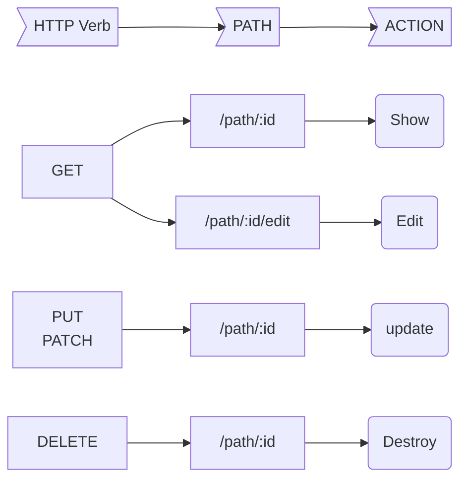

# ASSESSMENT 6: Interview Practice Questions
<h2>
  Answer the following questions.

  First, without external resources. Challenge yourself to answer from memory.

  Then, research the question to expand on your answer. Even if you feel you 
  have answered the question completely on your own, there is always something 
  more to learn. Write your researched answer in your OWN WORDS.
</h2>

--------------------------------------------------------------------------------
<h2>
  1. As a developer, I am creating a Rails application with a model called 
  Cohort that has_many students, but OOPS! I forgot to add the foreign key. How 
  can I fix this mistake? What is the name of the foreign key? Would the foreign 
  key be on the Cohort model or the Student model?
</h2>

### Your answer:
* In order to fix this you would need to add the foreign key "cohort_id" with a 
data type of "integer" to the Student model. To do this you would need to create
a migration action in the terminal such as:

terminal
```bash
// format  => rails g migration <migration_action_name>
// example => rails g migration add_foreign_key
```

* This will create a migration file in your ruby application in db/migrate 
folder. You would then need to add the migration action you wish to happen in 
your table, which would be reflected in your model.

* you would declare the method "change" in that file, then a enter the 
information you want to change in this format bellow:

db/migrate/<RUBY_DATE_TIME_STAMP>_<migration_action_name>.rb
```ruby
  def change
   #<action> <table to change>, <column to add>, <table value>
    add_column :students, :cohort_id, :integer
  end
```

* After that you would want to do migrate your changes in the terminal to take 
affect:

terminal
```bash
rails db:migrate
```

* Once you do that your changes have taken effect and your model Student will 
have the foreign key of cohort_id associated with it.


### Researched answer:
* According to: https://scmsantar.com/scmsantar/releases/20111219183956/RAILS_ENV=production/ruby/1.9.1/gems/railties-3.1.3/guides/output/migrations.html
  * It looks like you could roll back your migration with the command:
  ```bash
    rails db:rollback
  ```
  * This will effectively roll back a migration 1 step. If you needed to go back more than one step, (lets say 3 migrations worth) you could use the command:
  ```bash
    rails db:rollback STEP=3
  ```
  * After rolling back, it looks like you would want to enter:
  ```bash
    rails db:reset
  ```
  * This command drops the database and recreates it with the current scheme.
  * After that you could recreate the model with the foreign key you forgot to 
  add, then db:migrate.


--------------------------------------------------------------------------------
## 2. Which RESTful routes must always be passed params? Why?

### Your answer:
* The RESTful routes that must always be passed params are:
  * Show
  * Edit
  * Update
  * Destroy
* These RESTful routes must be passed params because they need to know the 
specific data in the model to apply the routes for.

### Researched answer:
* According to: https://guides.rubyonrails.org/v3.1/routing.html
  * The RESTful routes that must have params passed are:
    * GET
    * PUT
    * DELETE

  * They require params since in order to route they need to know the specific 
    object they are routing to in order to accomplish the task.

RESTfull routes that require params:

----


--------------------------------------------------------------------------------
## 3. Name three rails generator commands. What is created by each?

### Your answer:
* Three rails generator commands are:

```bash
   rails generate model <Model_Name> <column_name>:<column_value> 
```
  * This creates a model to be used to for the rails application. 

```bash
  * rails generate migration <action_name_here>
```
  * this migrates the changes in the database that were created in the rails 
  app. 

```bash  
  * rails generate resource <Model_Name> <column_name>:<column_value> 
```
  * this is an all-in-one command that accomplishes many things such as creating
   the model, migrations, and setting up the routes.

### Researched answer:

--------------------------------------------------------------------------------
<h2> 
  4. Consider the Rails routes below. What is the name of the controller method 
  that would be called by each route? What action would each of the controller 
  methods perform?
</h2>

### action: "GET" location: /students
* index
  * This would be used to display all of the objects in the table from the 
  database
  * This would show all the students

### action: "POST" location: /students
* create 
  * This creates a new object based on the data that was inputted on the form
  created by the new method.
  * This would create a new student

### action: "GET" location: /students/new
* new
  * This would be used to display a page with a form which would be used by the
  to input data to be used by the "create" method to create a new object for
  your database.
  * This would show a form for creating a new student 

### action: "GET" location: /students/2
* show
  * This would be used to show a specific object in the database.
  * This would show the student with :id value of 2

### action: "GET" location: /students/2/edit
* edit
  * This is similar to the "new" method, except this shows a form to be used to 
  update values in an object.
  * this would show a form to edit student with :id value of 2

### action: "PATCH" location: /students/2
* update
  * This is similar to the "create" method, except it is updating an object 
  that has already been created based on the data entered in the edit form.
  * This would update the values of the student with :id value of 2

### action: "DELETE" location: /students/2
* destroy
  * This deletes the selected object.
  * This would destroy the student with the :id value of 2

--------------------------------------------------------------------------------
<h2>
  5. As a developer, you are making an application to manage your to do list. 
  Create 10 user stories that will help you get your application started. Read 
  more about 
  [user stories](https://www.atlassian.com/agile/project-management/user-stories).
</h2>
<br>

<h3>

  1. As a user I can see a title for the application.

  2. As a user I see a text-area that displays a heading of "To-Do List".

  3. As a user I see a text field with a label "task".

  4. As a user I see a text field with a label "due date".

  5. As a user I see a text field with a label "description".

  6. As a user when I can see a button that says "Add To List".

  7. As a user when I click on the "Add To List" button, it displays the data I 
     entered in all the text-fields in the "To-Do List" text area.

  8. As a user when I can click on the "Add To List" button multiple times to 
     add multiple tasks.

  9. As a user when I can see a button that says "Completed"

  10. As a user when I have a task selected, and click on the "Completed" button
      it removes the task from the "To-Do List" text area.

</h3>

  <!-- Miss-read this section and had to re-do it >.< -->
  <!-- 
  1. As a user I can see a title for the application.

  2. As a user I see a button that I can click on called "Add Choice".

  3. As a user when I click on "Add Choice", it creates a window that contains
    A new button that says "Press for Selection".

  4. As a user when I click on "Add Choice" multiple times to create multiple
    windows that contain the "Press for Selection" button.

  5. As a user when I click on "Press for Selection", it shows a restaurant name.

  6. As a user when I click on "Press for Selection", it shows a link to the 
    restaurant.

  7. As a user when I click on the link it shows me the webpage of the restaurant.

  8. As a user when I click on "Press for Selection", it shows a picture of the 
    genre of food.

  9. As a user when I click on "Press for Selection", it shows a random 
    restaurant name with associated link, and picture.

  10. As a user I see a button that I can click on called "Reset" that removes all
      the windows. -->